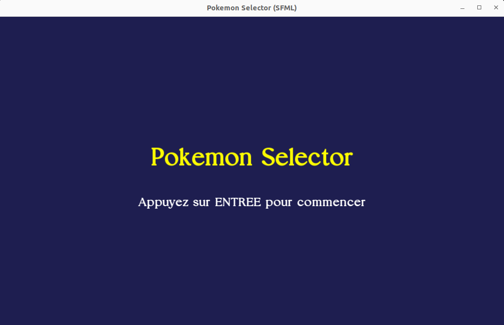
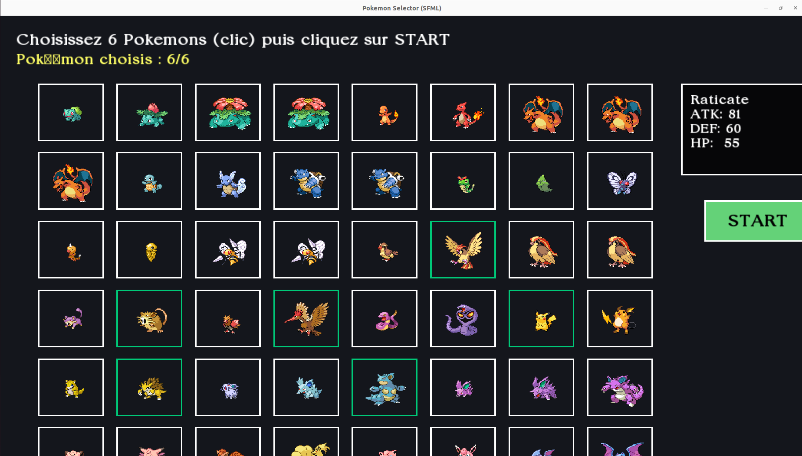
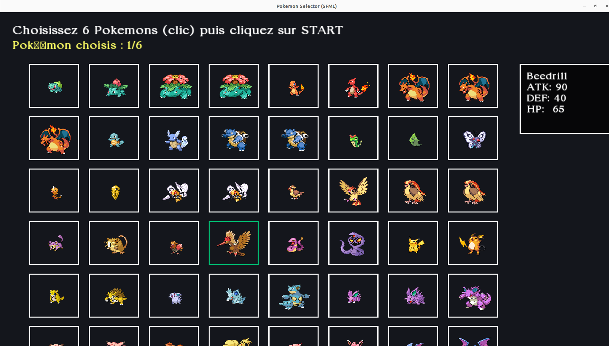
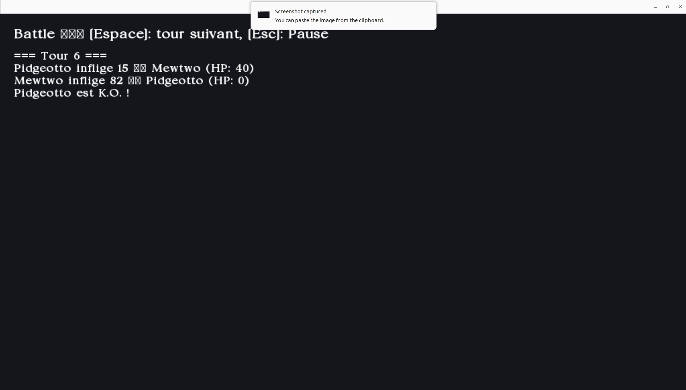
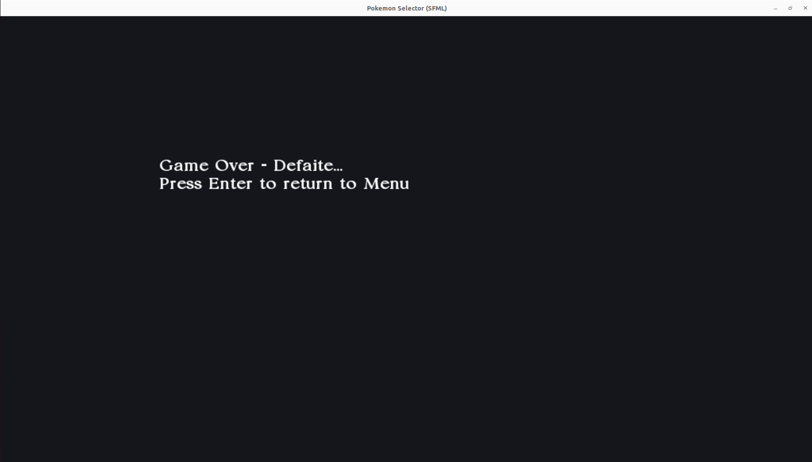
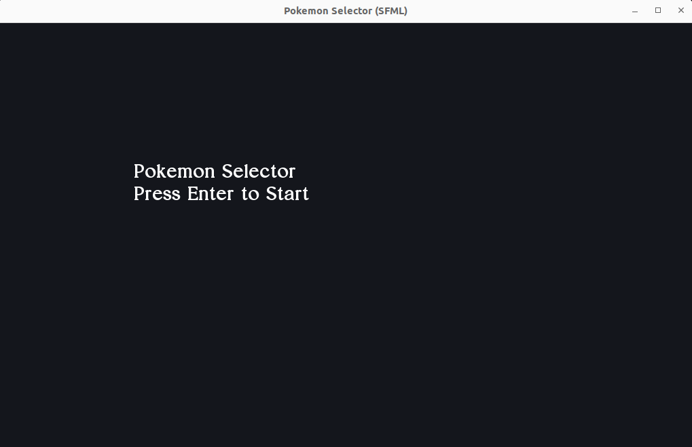

# Pokemon Selector

## Introduction
Projet C++ utilisant **SFML** pour créer un jeu de sélection et de combat de Pokémons.  
Réalisé dans le cadre du TP de 3ème année IS (2025-2026).

Encadré par **M. TAUVEL**

---

## 1. Mise en place du Framework SFML

### 1.1 Installation de SFML
Sous Debian/Ubuntu, utilisez la commande suivante pour installer SFML :

```bash
sudo apt-get install libsfml-dev
```

### 1.2 Cloner le projet
Clonez le dépôt depuis GitHub :

```bash
git clone git@github.com:ChahrazedBaatout/Pokemon.git
cd pokemon
```

### 1.3 Compilation avec CMake
Ensuite, compilez avec **CMake** :

```bash
cmake -S . -B build
cmake --build build
```

### 1.4 Copier les ressources
⚠️ **Important** : après compilation, il faut copier le dossier `resources` (qui contient les images, polices et CSV) dans le dossier `build/` :

```bash
cp -r resources build/
```

### 1.5 Lancer le jeu
Exécutez ensuite le jeu avec :

```bash
./build/pokemon_selector
```

---

## 2. Structure du projet

```
.
├── include/              # Fichiers headers (.hpp)
├── src/                  # Code source (.cpp)
│   ├── Engine/           # Moteur de jeu (State, Game, Assets, etc.)
│   ├── States/           # Différents états du jeu (Menu, Sélection, Combat…)
│   └── MOdel         
├── resources/            # Images, polices, CSV
│   ├── arial.ttf          
│   ├── pokemon/
│   └── pokemon.csv
├── CMakeLists.txt
│── main.cpp              # Point d'entrée
└── README.md

```

---

## 3. Fonctionnalités

- **Menu principal** : page d’accueil avec démarrage du jeu.
- **Sélection d’équipe** : choisir 6 pokémons via une grille avec images.
- **Affichage des détails** : cliquer sur un pokémon affiche ses informations.
- **Bouton Start** : commence le combat une fois l’équipe complète.
- **Combat** : système de tours où les pokémons s’affrontent.
- **Fin du jeu** : affichage de l’équipe gagnante ou Game Over.

---

## 4. Captures d’écran

### Menu principal


### Sélection d’équipe


### Détails d’un pokémon


### Combat


### Fin du jeu


### Restart


---

## 5. Remarques

- Veillez à bien copier le dossier `resources` dans `build/`.
- Le projet suit le **design pattern State** pour gérer les différentes pages du jeu.
- Les images et le fichier `pokemon.csv` sont essentiels pour l’affichage et la logique.

---

## 6. Auteurs
- **Chahrazed Baatout** (3ème année IS)
- Encadré par **M. Tauvel**